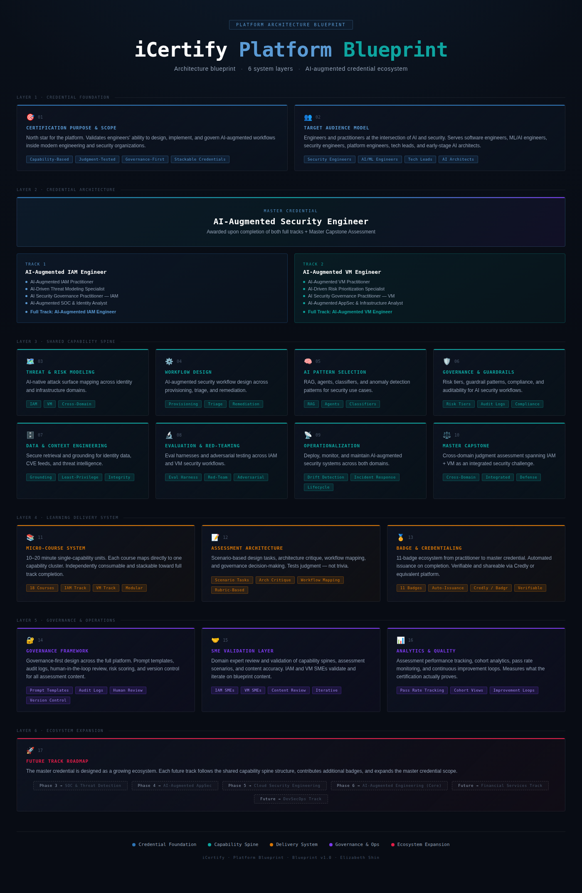

# Blueprint Gallery

  

A 6-layer architecture blueprint for the iCertify credential ecosystem, mapping the AI-Augmented Security Engineer master credential, shared capability spine, delivery system, governance framework, and expansion roadmap.

---

## Production-Grade RAG System

  

A production‑grade Retrieval‑Augmented Generation architecture that integrates hybrid search, cross‑encoder reranking, and automated evaluation to deliver grounded, traceable answers for internal knowledge workflows with consistent quality and governance.

---

## iCertify Architecture Blueprint

  

A multi‑layer credentialing platform architecture that unifies the AI‑Augmented Security Engineer master credential, capability pathways, delivery workflows, governance controls, and long‑term expansion roadmap into a governed, extensible ecosystem.

---

## Confluence Learning Hub Architecture

  

A Confluence‑based learning ecosystem architecture that mirrors real delivery workflows and provides a governed, modular foundation for capability development, content lifecycle management, and AI‑augmented learning across engineering and product teams.

---

## DailyDos System Map

  

A behavior‑design system that applies architectural principles to daily habit formation, demonstrating how human workflows can be structured with the same clarity as technical systems.

---

## Site navigation

- [Home](index.md)
- [Architecture Blueprints](blueprints.md)
- [AI-Augmented Engineering Certification](certification.md)
- [Portfolio Artifacts](artifacts.md)
- [About](about.md)
