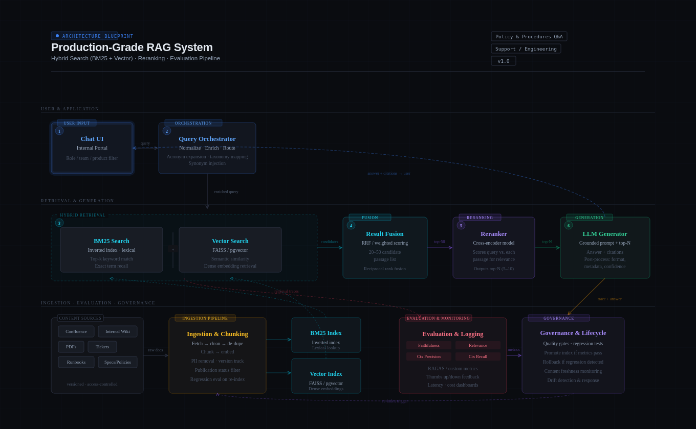
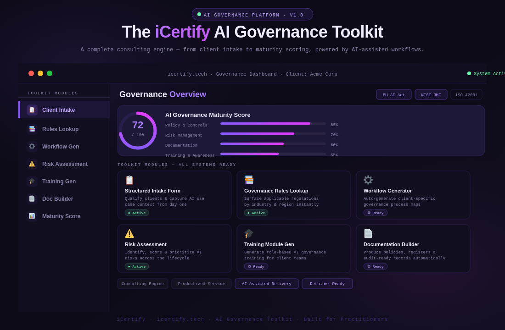
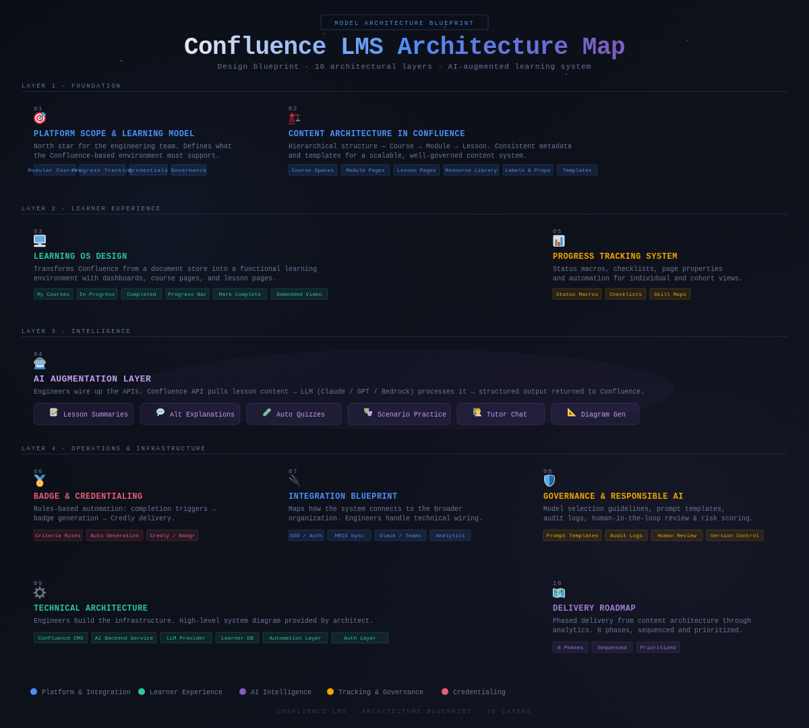
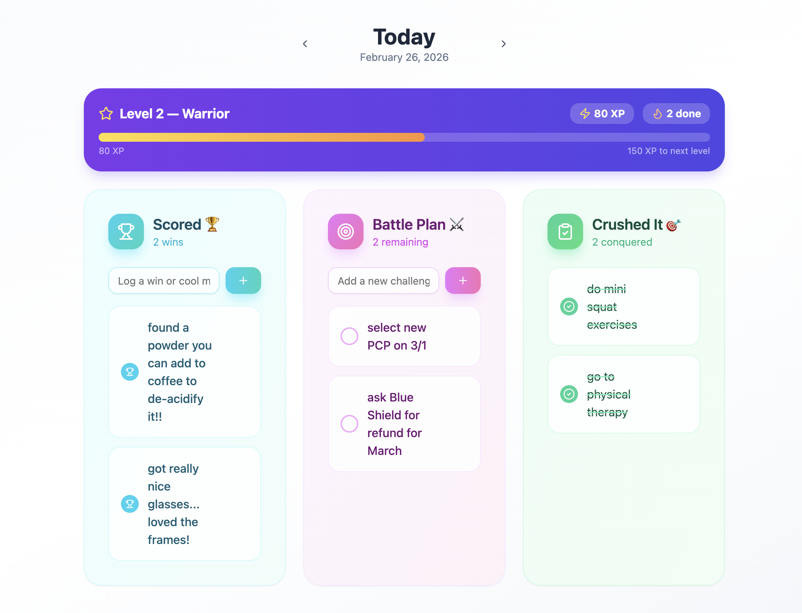

# Architecture Blueprints

## Production-Grade RAG System

  

This blueprint illustrates a production-grade Retrieval-Augmented Generation (RAG) system that combines hybrid search, reranking, and evaluation to deliver grounded, traceable answers for internal knowledge workflows.

---

## iCertify Architecture Blueprint

  

This blueprint outlines the modular, governance-first certification system designed for engineering and product teams.

---

## Confluence Learning Hub Architecture

  

This map shows the learning ecosystem architecture built on Confluence, aligned to real delivery workflows.

---

## DailyDos System Map

  

This system map illustrates the in-flow, habit-forming learning model that supports daily AI-native practice.

---

## Site navigation

- [Home](index.md)
- [Architecture Blueprints](blueprints.md)
- [AI-Augmented Engineering Certification](certification.md)
- [Portfolio Artifacts](artifacts.md)
- [About](about.md)
